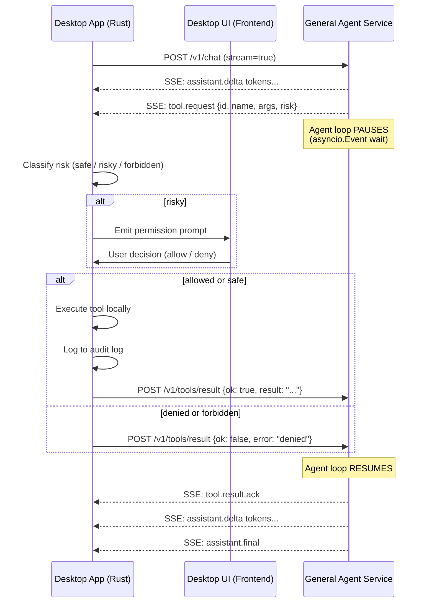

# General Agent Service API

This document defines the HTTP API contract between the JARVIS Desktop app and the General Agent Service (nanobot-based).

Goal: keep the desktop as the orchestrator, while the service provides general reasoning, memory, and tool planning.

## Design constraints

- Desktop owns the user-facing conversation.
- Desktop owns OS actions and safety gates.
- Service runs local-only (loopback), no public exposure.
- Service is stateless at the HTTP layer, stateful via explicit `session_id`.
- Streaming is first-class.

## Transport

- Protocol: HTTP on `127.0.0.1` (no 0.0.0.0 for MVP)
- Content types:
  - Requests: `application/json`
  - Streaming: `text/event-stream` (SSE)

## Identity and sessions

Terminology:

- `jarvis_session_id`: the desktop-visible conversation id
- `general_session_id`: the General Agent Service session id

Rules:

- Desktop maps `jarvis_session_id -> general_session_id`.
- Service never sees OpenCode ids or code-agent state.

## API overview

Required endpoints:

- `GET /health`
- `POST /v1/sessions`
- `POST /v1/chat`
- `GET /v1/stream` (optional alternative to streaming chat responses)
- `POST /v1/tools/result` (Desktop posts tool execution results back to service)
- `POST /v1/memory/write`
- `GET /v1/memory/search`

## Common envelope types

### MessagePart

```
{
  "type": "text",
  "text": "string"
}
```

Future parts:

- `type: "audio"` (desktop passes transcript only in MVP)
- `type: "image"` (desktop passes file references + base64 or URL)

### ToolCall

Tool calls are requests from the service to the desktop. The desktop may:

- auto-allow
- prompt the user
- deny

```
{
  "id": "toolcall_123",
  "name": "open_app",
  "arguments": { "app_id": "notion" },
  "risk": "safe" | "risky" | "forbidden",
  "reason": "why this action is needed"
}
```

### ToolResult

```
{
  "id": "toolcall_123",
  "ok": true,
  "result": "string",
  "error": null
}
```

## Endpoint specs

### GET /health

Response:

```
{
  "healthy": true,
  "version": "0.1.0",
  "uptime_ms": 12345
}
```

### POST /v1/sessions

Create (or resume) a service session.

Request:

```
{
  "jarvis_session_id": "j_abc",
  "preferred_session_id": "optional_existing_general_session_id"
}
```

Response:

```
{
  "general_session_id": "g_def"
}
```

### POST /v1/chat

Send a user message to the general agent.

Request:

```
{
  "general_session_id": "g_def",
  "mode": "general",
  "message": {
    "parts": [
      { "type": "text", "text": "Plan my week" }
    ]
  },
  "stream": true
}
```

If `stream=false`, response is a single final payload:

```
{
  "assistant": {
    "parts": [
      { "type": "text", "text": "..." }
    ]
  }
}
```

If `stream=true`, response is SSE.

SSE event types:

- `assistant.delta` (partial text)
- `assistant.final` (final text)
- `tool.request` (tool call request)
- `tool.result` (tool call result)
- `error`

Example SSE stream:

```
event: assistant.delta
data: {"text":"Sure - "}

event: assistant.delta
data: {"text":"here's a plan..."}

event: tool.request
data: {"id":"toolcall_1","name":"open_app","arguments":{"app_id":"calendar"},"risk":"risky","reason":"Need to check availability"}

event: assistant.final
data: {"text":"Done."}
```

### POST /v1/tools/result

Desktop posts tool execution results back to the service. The agent loop **pauses** after emitting a `tool.request` via SSE and waits for this POST to resume.

This is the only way tool results reach the agent — the service never executes tools directly.

Request:

```
{
  "general_session_id": "g_def",
  "tool_result": {
    "id": "toolcall_1",
    "ok": true,
    "result": "Launched Calendar",
    "error": null
  }
}
```

Response:

```
{ "accepted": true }
```

## Tool call lifecycle

The agent loop uses a **ProxyTool** pattern: tool schemas are registered with the LLM, but execution is delegated to the Desktop. The SSE connection from `/v1/chat` stays open throughout.



**Implementation detail**: The service uses a per-session `asyncio.Event` for coordination. When the agent loop needs a tool result, it sets a pending request and awaits the event. The `/v1/tools/result` endpoint sets the result and signals the event, unblocking the agent loop.

### POST /v1/memory/write

Request:

```
{
  "general_session_id": "g_def",
  "target": "long_term" | "daily",
  "content": "string"
}
```

Response:

```
{ "path": "memory/MEMORY.md" }
```

### GET /v1/memory/search

Query params:

- `q`: search string
- `kind`: optional
- `limit`: optional

Response:

```
{
  "results": [
    {
      "path": "memory/2026-02-11.md",
      "excerpt": "...",
      "line_start": 12,
      "line_end": 18
    }
  ]
}
```

Notes:

- Memory is stored as Markdown in the agent workspace (nanobot/OpenClaw-style).
- `memory/search` returns snippets with paths and line ranges so the UI can cite or open the source.
- A future `GET /v1/memory/get` can be added to fetch a specific file range; for MVP, Desktop can read files directly if needed (within workspace constraints).

## SSE resilience contract

### Reconnection

- If the SSE connection drops, the Desktop client should reconnect automatically after a 1-second delay.
- Use exponential backoff on repeated failures (1s → 2s → 4s, capped at 30s).
- If a disconnect occurs **mid-turn** (during streaming), the client re-sends the last user message to replay the turn.
- If a disconnect occurs **between turns**, just reconnect — no missed events to replay.

### Last-Event-ID (post-MVP)

> [!NOTE]
> Event replay via `Last-Event-ID` is deferred to post-MVP. The re-send-on-disconnect strategy above is sufficient for a local-only app where disconnects are rare.

### Heartbeat

- The service sends a keep-alive comment (`: heartbeat`) every 15 seconds on idle connections.
- If the client receives no data (including heartbeats) for 30 seconds, it should consider the connection dead and reconnect.

### Timeout

- The service should not close the SSE connection during an active chat turn (including while waiting for tool results).
- The service may close idle connections after 10 minutes with no activity.

## Error model

All non-2xx responses:

```
{
  "error": {
    "code": "string",
    "message": "string",
    "details": {}
  }
}
```

## Security requirements

- Bind to loopback only.
- No arbitrary file access outside the service workspace.
- No raw shell execution in MVP, or enforce a strict allowlist.
- Desktop is the final authority for OS tools.

## See also

- `05-tools-and-safety.md` — Tool classification and safety model
- `13-desktop-app.md` — Desktop app tool execution engine and IPC commands
- `04-integrations-nanobot.md` — General Agent Service integration and sandboxing
