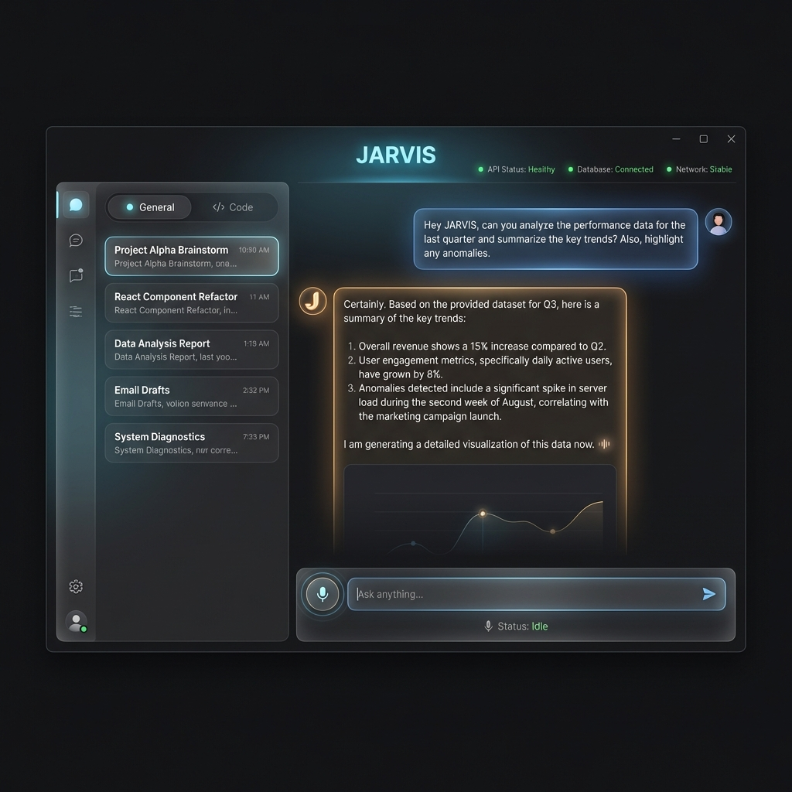
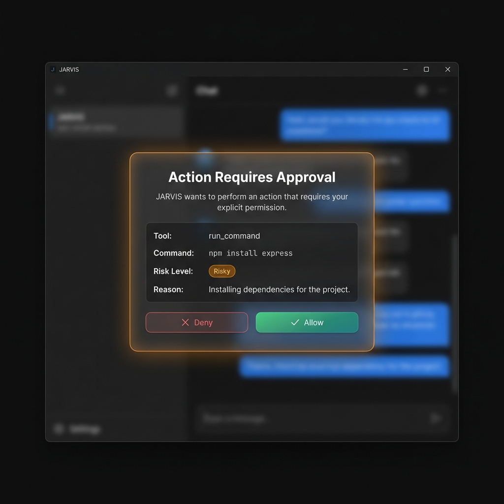
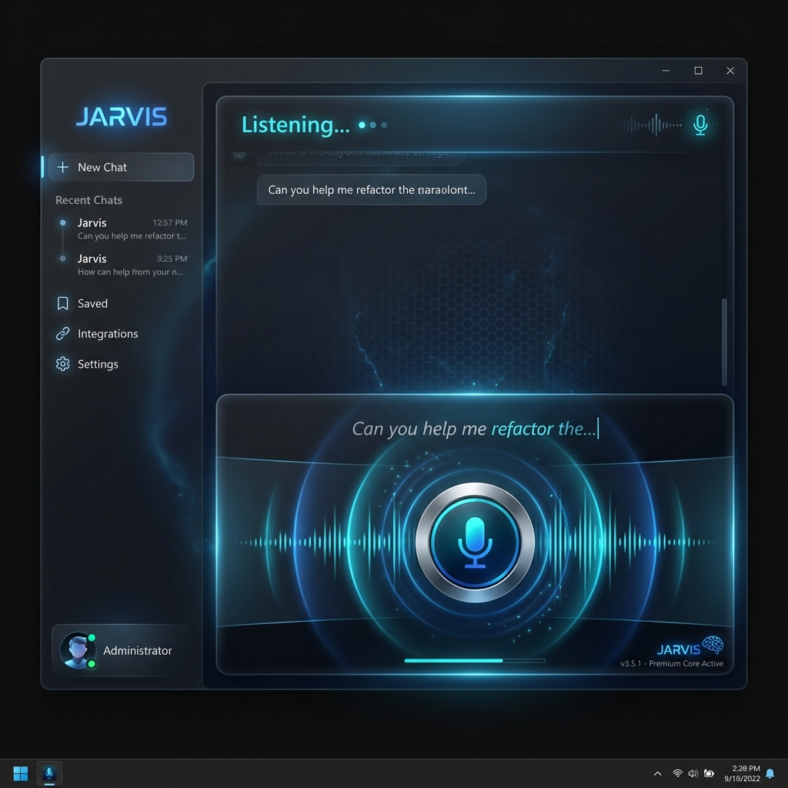
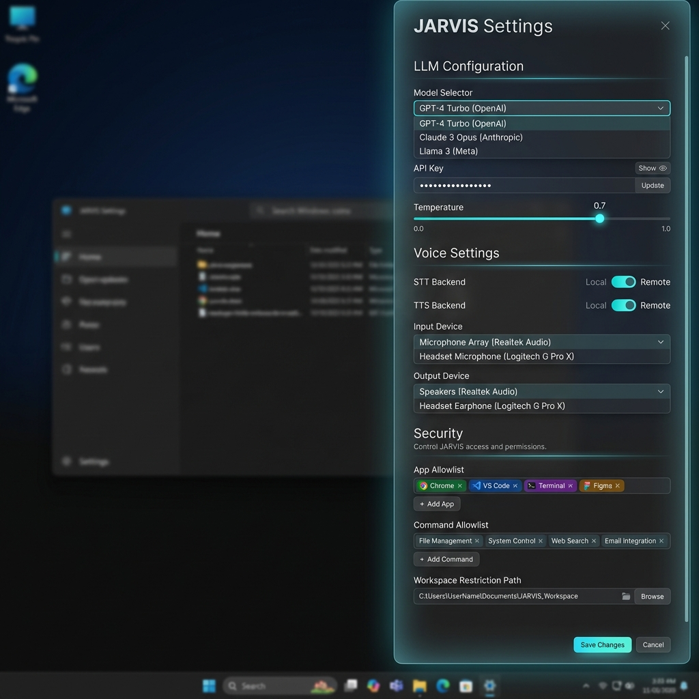

# UI Design System

This document defines the visual design direction, design tokens, and key screen layouts for the JARVIS desktop app.

## Design Philosophy

JARVIS should feel **premium, intelligent, and trustworthy** - like a high-end control surface, not a chatbot.

Design pillars:

- **Windows-native** - looks at home on Windows 11 (Fluent-adjacent), not a web app.
- **Instrument panel** - surfaces status, tools, and approvals clearly; avoids sci-fi theatrics.
- **Restrained glass** - use opacity + subtle noise; blur is optional and limited.
- **Meaningful highlights** - glow only when it means something (listening, approval needed, error).
- **Crisp typography** - prioritize readability and hierarchy over novelty.
- **Micro-animations** - smooth transitions, but fewer looping pulses.
- **Dual-mode input** — Text and voice are equal citizens. Text input is the default and must feel premium on its own — rich editing, markdown preview, keyboard shortcuts. Voice (PTT) is an equally powerful companion, not a gimmick.

## Design References

Premium AI desktop apps that inspire the JARVIS aesthetic:

| Reference | What to borrow |
|-----------|---------------|
| **Claude Desktop** | Warm tones in dark mode, clean message layout, minimal sidebar |
| **ChatGPT Desktop** | Companion window pattern (Alt+Space), sidebar with conversation list |
| **Cursor IDE** | Dense but readable layout, status bar with service indicators, dark theme with accents |
| **Warp Terminal** | Glassmorphism theming, GPU-accelerated rendering feel, block-based input area |

## Color Palette

```css
:root {
  /* Backgrounds */
  --bg-primary:      #0B0D10;     /* Main app background (neutral graphite) */
  --bg-secondary:    #101419;     /* Sidebar, panels */
  --bg-surface:      #131922;     /* Cards, assistant bubbles */
  --bg-elevated:     #18202B;     /* Elevated panels, dropdowns */
  --bg-glass:        rgba(16, 20, 25, 0.72); /* Optional glass panels */
  
  /* Accent */
  --accent-primary:  #46D6E9;     /* Cyan - primary interactive (restrained) */
  --accent-glow:     rgba(70, 214, 233, 0.12); /* Use sparingly; must indicate meaning */
  --accent-warm:     #FF8A4C;     /* Warm highlight for assistant emphasis */
  
  /* Text */
  --text-primary:    #E7E9EE;     /* Main text */
  --text-secondary:  #A7AFBE;     /* Secondary text, timestamps */
  --text-muted:      #6B7280;     /* Disabled, placeholder */
  
  /* Semantic */
  --color-success:   #2BD4A6;     /* Healthy, allowed */
  --color-warning:   #F7B955;     /* Risky, attention */
  --color-danger:    #FF5A6B;     /* Forbidden, error */
  --color-info:      #5AA7FF;     /* User messages */
  
  /* Borders */
  --border-subtle:   rgba(255, 255, 255, 0.08);
  --border-glass:    rgba(255, 255, 255, 0.10);
  
  /* Shadows */
  --shadow-glow:     0 0 18px rgba(70, 214, 233, 0.10);
  --shadow-elevated: 0 12px 40px rgba(0, 0, 0, 0.55);
}
```

Rule of thumb: if it glows, it must mean something.

## Typography

```css
/* Font stack */
font-family: 'Segoe UI Variable', 'Segoe UI', system-ui, sans-serif;

/* Scale */
--font-xs:    0.75rem;   /* 12px — timestamps, badges */
--font-sm:    0.8125rem; /* 13px — secondary text */
--font-base:  0.875rem;  /* 14px — body text, messages */
--font-md:    1rem;       /* 16px — section headers */
--font-lg:    1.25rem;   /* 20px — panel titles */
--font-xl:    1.5rem;    /* 24px — app title */

/* Weight */
--weight-normal:  400;
--weight-medium:  500;
--weight-semibold: 600;

/* Line height */
--leading-tight:  1.3;
--leading-normal: 1.6;
```

Monospace (code blocks):

```css
font-family: ui-monospace, SFMono-Regular, Menlo, Consolas, "Liberation Mono", monospace;
```

## Spacing & Radius

```css
--space-xs:  4px;
--space-sm:  8px;
--space-md:  16px;
--space-lg:  24px;
--space-xl:  32px;

--radius-sm:  6px;
--radius-md:  12px;
--radius-lg:  16px;
--radius-xl:  24px;   /* Glassmorphism panels */
```

## Glassmorphism Recipe

For frosted glass panels (sidebar, dialogs, input bar):

```css
.glass-panel {
  /* Fallback: solid semi-transparent background for low-end GPUs or unsupported WebViews */
  background: rgba(22, 33, 62, 0.85);
  border: 1px solid var(--border-glass);
  border-radius: var(--radius-xl);
  box-shadow: var(--shadow-elevated);
}

@supports (backdrop-filter: blur(1px)) {
  .glass-panel {
    background: var(--bg-glass);
    backdrop-filter: blur(20px);
    -webkit-backdrop-filter: blur(20px);
  }
}

/* User preference: disable blur effects */
.reduce-effects .glass-panel {
  backdrop-filter: none;
  -webkit-backdrop-filter: none;
  background: rgba(22, 33, 62, 0.92);
}
```

**Performance rules:**
- Limit to **1-2 concurrent blurred panels** at any time (sidebar + input bar, OR sidebar + approval sheet).
- When an approval prompt opens, temporarily disable blur on the input bar.
- Test on integrated Intel GPUs as the performance floor
- Settings includes a "Reduce visual effects" toggle that adds `.reduce-effects` to the root element

## Key Screens

### Main Chat View

````carousel

<!-- slide -->

**Layout structure:**

```
┌──────────────────────────────────────────────────┐
│  ● JARVIS                    [status dots] [─□×] │
├──────────┬───────────────────────────────────────┤
│ Sidebar  │                                       │
│ ┌──────┐ │         Chat Messages                 │
│ │Gen|Co│ │    (streaming, scrollable)             │
│ └──────┘ │                                       │
│          │  ┌─ User ─────────────────────┐       │
│ Convo 1  │  │ Can you analyze the data?  │       │
│ Convo 2  │  └────────────────────────────┘       │
│ Convo 3  │                                       │
│          │  ┌─ JARVIS ───────────────────┐       │
│          │  │ Based on the Q3 dataset... │       │
│ ┌──────┐ │  │ 1. Revenue up 15%         │       │
│ │ ⚙ ℹ  │ │  │ 2. Daily active users...  █       │
│ └──────┘ │  └────────────────────────────┘       │
├──────────┴───────────────────────────────────────┤
│  🎤  [  Ask anything...                    ] [➤] │
│                              🎙 Status: Idle     │
└──────────────────────────────────────────────────┘
```
````

- **Sidebar**: Glassmorphism panel. Mode switch (General/Code) at top. Conversation list below. Settings/info icons at bottom.
- **Chat area**: Messages scroll with smooth animation. Assistant messages have a subtle warm glow left-border. User messages are right-aligned with blue tint.
- **Input bar**: Frosted glass. Mic button (PTT) with accent ring. Text input. Send button.
- **Top bar**: App name with subtle glow. Service health dots (green = healthy, amber = degraded, red = down).

### Permission Dialog

````carousel

<!-- slide -->

**Dialog elements (MVP):**

| Element | Design |
|---------|--------|
| Backdrop | Chat view dimmed to 30% opacity, blurred |
| Panel | Glassmorphism with amber border glow |
| Title | "Action Requires Approval" — semibold, large |
| Details | Tool name, parameters, risk badge, reason text |
| Risk badge | Green (safe), Amber (risky), Red (forbidden) |
| Deny button | Outline style, red tint, left position |
| Allow button | Solid gradient (green-teal), right position |
````

Recommended refinement (post-MVP or if it tests better): render approvals as a bottom sheet anchored above the input bar to keep focus on the action flow.

### Voice Active State

````carousel

<!-- slide -->

**Voice state transitions:**

| State | Mic Icon | Status Text | Color |
|-------|----------|-------------|-------|
| Idle | Outline | "Status: Idle" | `--text-secondary` |
| Listening | Filled + pulsing rings | "Listening..." | `--accent-primary` (cyan) |
| Processing | Spinner replacing mic | "Transcribing..." | `--accent-primary` |
| Speaking | Speaker icon, animated | "Speaking..." | `--accent-warm` (orange) |

- Partial transcript appears above input in *italic, dimmed* text
- Audio waveform visualization next to mic during capture
- All transitions: 200ms ease-in-out
````

Recommended change: keep voice as an overlay/pill above the input bar (status + waveform + partial transcript). Reserve the large "voice panel" for an optional Talk Mode.

### Settings Panel

````carousel

<!-- slide -->

**Settings sections:**

1. **LLM Configuration** — Model dropdown, API key (masked), temperature slider
2. **Voice Settings** — STT/TTS backend toggles (Local ↔ Remote), device dropdowns
3. **Security** — App allowlist (tag chips), command allowlist, workspace path
4. **About** — Version, sidecar versions, log locations

Toggle switches use `--accent-primary` (cyan) when active. Slider tracks use same accent. All inputs have `--bg-elevated` background with `--border-subtle` borders.
````

## Animation Guidelines

| Element | Animation | Duration | Easing |
|---------|-----------|----------|--------|
| Sidebar open/close | Slide + fade | 250ms | `ease-out` |
| Message appear | Fade-in + slide-up | 200ms | `ease-out` |
| Streaming token | Caret blink + block reveal | 200ms | `ease-out` |
| PTT ring pulse | Scale 1.0 → 1.2 → 1.0 | 1200ms | `ease-in-out`, infinite |
| Status change | Color crossfade | 200ms | `ease-in-out` |
| Dialog appear | Scale 0.95 → 1.0 + fade | 200ms | `ease-out` |
| Settings slide-in | translateX(100%) → 0 | 300ms | `cubic-bezier(0.16, 1, 0.3, 1)` |
| Health dot pulse | Opacity 0.6 → 1.0 | 2000ms | `ease-in-out`, infinite |

## Component Library (Key Components)

### Message Bubble

- **User**: Right-aligned, `--color-info` subtle background, rounded corners (top-left, bottom-left, bottom-right)
- **Assistant**: Left-aligned, `--bg-surface` background, warm glow left border (`--accent-warm` 2px), full rounded corners
- **Rich text rendering**: Assistant messages render markdown — headings, bold/italic, code blocks (syntax highlighted), lists, tables, and links
- **Code blocks**: Dark elevated background (`--bg-elevated`), language label badge, one-click copy button
- **Streaming indicator**: Blinking cursor `█` at end of text, 500ms blink rate

### Run Cards (Code Mode)

In code mode, show tool work as structured, collapsible "run cards" in the transcript:

- Command card: command, cwd/repo label, duration, exit code, truncated output + expand
- Patch card: file path, additions/deletions summary, inline diff viewer
- Test card: grouped results, failures highlighted, copy failure details
- Permission card: pending approval state + allow/deny actions

These should be readable without feeling like a terminal dump.

### Mode Switch

- Segmented control with two options: `● General` / `</> Code`
- Active segment: `--accent-primary` background with glow
- Inactive segment: transparent, `--text-secondary` text
- Smooth slide animation on switch (200ms)

### Health Indicators

- Small dots (8px) in the top bar
- Three dots: General Agent, OpenCode, System
- Colors: `--color-success` (healthy), `--color-warning` (degraded), `--color-danger` (down)
- Subtle pulse animation on healthy state

### Input Bar

The input bar is the primary interaction surface — it must feel as premium for typing as it does for voice.

- Full-width frosted glass panel at bottom
- **Text input** (default, always visible):
  - Auto-expanding textarea — starts single-line, grows up to 6 lines as the user types
  - `--text-primary` foreground, transparent background
  - Placeholder: "Ask anything..." in `--text-muted`
  - **Keyboard shortcuts**:
    - `Enter` → send message
    - `Shift+Enter` → new line
    - `Ctrl+↑` → recall previous message (edit and resend)
    - `Ctrl+L` → clear conversation
  - **File drop zone**: Drag files onto the input to attach. Shows a subtle dashed border highlight on drag-over.
  - **Paste support**: Paste images from clipboard (displayed as thumbnail preview above input)
- **Mic button** (PTT companion): Circular, positioned left of the text input. `--accent-primary` border. Hover: glow. Active (PTT held): filled + pulsing rings. Voice and text never conflict — releasing PTT inserts transcript into the text input for review before sending.
- **Mic button** (PTT companion): Circular, positioned left of the text input. `--accent-primary` border. Hover: subtle highlight. Active (PTT held): filled + pulsing ring. Voice and text never conflict - releasing PTT inserts transcript into the text input for review before sending.
- **Send button**: `--accent-primary` background, arrow icon. Disabled state when input is empty.

## Responsive Behavior

JARVIS is a desktop app, not responsive in the web sense — but it should handle window resizing gracefully:

| Window Width | Behavior |
|-------------|----------|
| ≥ 900px | Full layout: sidebar + chat |
| 600–899px | Sidebar collapses to icon-only rail |
| < 600px | Sidebar hidden, toggle button in top bar |

Minimum window size: 500×400px.

## See also

- `13-desktop-app.md` — Frontend component structure and architecture
- `06-voice-ux.md` — Voice pipeline specifications
- `10-mvp-checklist.md` — MVP feature requirements
- `20-ui-review-and-recommendations.md` — Rationale and refined Windows-first direction
