# Implementation Roadmap

This document locks in all decisions and defines the phased implementation plan for JARVIS MVP.

## Decisions (Locked)

| Decision | Choice | Rationale |
|----------|--------|-----------|
| Default LLM | **GPT-4o-mini** (OpenAI API) for dev; swap to Claude Sonnet 4.5 or others via config | Provider-agnostic — cheapest option for dev, upgrade anytime |
| Code Agent | **OpenCode latest** (sst/opencode, ~v1.0.204+) | Native server mode, permission API, active development |
| General Agent base | **nanobot source** (HKUDS/nanobot, v0.1.3+) | ~4k lines Python, clean agent loop, adapt directly |
| Desktop framework | **Tauri v2** + React + TypeScript | Native performance, small binary, Rust sidecar management |
| Frontend bundler | **Vite** | Fast dev server, Tauri v2 default |
| Voice: STT | **Provider-agnostic** (default: faster-whisper base) | Abstract interface; swap via config (faster-whisper, whisper.cpp, cloud API, etc.) |
| Voice: TTS | **Provider-agnostic** (default: Windows SAPI) | Abstract interface; swap via config (SAPI, cloud TTS, etc.) |
| General memory | **Workspace Markdown** (nanobot/OpenClaw-style) | Transparent + user-editable; avoid overlapping memory systems |
| Memory search (optional) | **Rebuildable index** (SQLite FTS/embeddings) | Cache only; can be added post-MVP |
| Config/secrets | **OS keychain** (Windows Credential Manager) for API keys, JSON for non-sensitive config |

## Project Structure

```
jarvis/
├── desktop/                    # Tauri v2 app
│   ├── src-tauri/              # Rust backend
│   │   ├── src/
│   │   │   ├── main.rs         # Entry point
│   │   │   ├── sidecar.rs      # Sidecar lifecycle (spawn, health, restart)
│   │   │   ├── commands.rs     # Tauri IPC command handlers
│   │   │   ├── tools.rs        # Tool execution engine + audit logger
│   │   │   └── audio.rs        # Mic capture, STT dispatch, TTS playback
│   │   ├── Cargo.toml
│   │   └── tauri.conf.json
│   ├── src/                    # React frontend
│   │   ├── App.tsx
│   │   ├── components/         # ChatView, ChatInput, ModeSwitch, etc.
│   │   ├── hooks/              # useChat, useVoice, useSidecar
│   │   ├── lib/                # Typed IPC wrappers, SSE client, types
│   │   └── styles/             # CSS with design tokens from 14-ui-design.md
│   ├── package.json
│   └── vite.config.ts
│
├── agent/                      # General Agent Service (Python)
│   ├── main.py                 # FastAPI app entry point
│   ├── api/
│   │   ├── routes.py           # /health, /v1/sessions, /v1/chat, /v1/tools/result
│   │   ├── streaming.py        # SSE response writer
│   │   └── models.py           # Pydantic request/response schemas
│   ├── agent/
│   │   ├── loop.py             # Streaming agent loop (adapted from nanobot)
│   │   ├── context.py          # Session context + memory injection
│   │   ├── proxy_tools.py      # ProxyTool pattern — emit requests, await Desktop results
│   │   └── tools.py            # Tool schema definitions (name, params, description)
│   ├── workspace/
│   │   ├── AGENTS.md           # Agent operating instructions (seed/template)
│   │   ├── USER.md             # User profile (seed/template)
│   │   ├── TOOLS.md            # Tool conventions (seed/template)
│   │   └── memory/             # Memory files live at runtime (MEMORY.md + daily logs)
│   ├── config.py               # Settings, LLM provider config
│   ├── requirements.txt
│   └── tests/
│       ├── test_api.py
│       └── test_agent.py
│
├── docs/                       # (existing) Design docs + mockups
├── code_reference/             # (existing) OpenCode + nanobot reference source
└── README.md                   # Project root readme
```

## Implementation Phases

### Phase 0: Contracts + Stubs (Contract-First)

Before building real sidecars, freeze interfaces and build test stubs so frontend and backend can work in parallel.

Plan details: `jarvis/docs/21-implementation-plan-contract-first.md`.

### Phase 1: General Agent Service (Headless)
*Target: fully testable API with no UI dependency*

```mermaid
gantt
    title Phase 1 — General Agent Service
    dateFormat  X
    axisFormat %s

    section Core
    FastAPI scaffold + /health        :p1a, 0, 1
    Pydantic models (API contract)    :p1b, 0, 1
    Workspace memory files            :p1c, 1, 2
    Session management                :p1d, 1, 2

    section Agent Loop
    Streaming agent loop (LiteLLM)    :p1e, 2, 4
    OpenAI API integration            :p1f, 2, 3
    ProxyTool pattern (emit+await)    :p1g, 3, 4

    section Streaming
    SSE streaming /v1/chat            :p1h, 4, 5
    Tool request/result via SSE       :p1i, 4, 5

    section Verification
    API tests (pytest)                :p1j, 5, 6
    Manual curl/httpie testing        :p1k, 5, 6
```



> [!IMPORTANT]
> **Key complexity**: The nanobot agent loop is non-streaming. We must modify it to use `acompletion(..., stream=True)` for real-time token display, and replace local tool execution with the ProxyTool pattern (emit `tool.request` via SSE, await Desktop's POST to `/v1/tools/result`).

Deliverable: `python -m uvicorn main:app` → fully functional agent you can chat with via curl.

---

### Phase 2: Desktop Shell + Chat UI
*Target: Tauri app with streaming chat, mode switch, no voice yet*

Steps:
1. Scaffold Tauri v2 + Vite + React + TypeScript project
2. Implement design system (CSS tokens from `14-ui-design.md`)
3. Build core components: ChatView, ChatInput, ModeSwitch, StatusBar
4. Implement Rust sidecar manager (spawn General Agent, health polling)
5. Wire General mode chat: text input → IPC → HTTP to agent → SSE stream → render
6. Implement permission dialog (tool.request → UI prompt → POST result)
7. Integrate OpenCode sidecar:
   - Spawn, health polling, verify agents via `GET /config`
   - SSE event stream subscription (`GET /event`)
   - **Part-aware rendering**: text, tool, patch (inline diff), step markers
   - **Completion heuristics**: activity-based detection, generous timeouts, intermediate fragment rejection
   - **Session abort**: UI stop button → `POST /session/abort`
   - **File sync retry**: 10-15s window after turn completes before finalizing
8. Audit log viewer

> [!WARNING]
> OpenCode integration is more complex than General Agent integration. OpenCode is a stateful session machine with a rich message parts model — see `03-integrations-opencode.md` for the full playbook.

Deliverable: Working desktop app with text chat to both agents, streaming, and permission prompts.

---

### Phase 3: Voice
*Target: PTT input and TTS output*

Steps:
1. Define abstract `STTProvider` and `TTSProvider` interfaces (so backends are swappable via config)
2. Rust audio capture (mic stream via cpal/rodio)
3. Implement default STT provider (faster-whisper) + adapter for cloud APIs
4. PTT flow: capture → transcribe via configured provider → insert into text input
5. Implement default TTS provider (Windows SAPI) + adapter for cloud voices
6. Voice state indicators (Idle/Listening/Processing/Speaking)
7. Interrupt handling (PTT during TTS stops playback)

Deliverable: Full voice loop with swappable STT/TTS providers, working alongside text input.

---

### Phase 4: Polish + Packaging
*Target: Installable, production-ready*

Steps:
1. Glassmorphism and animations (micro-interactions from design doc)
2. Settings panel (LLM config, voice config, security allowlists)
3. System tray integration (open/mute/exit)
4. Error handling and sidecar crash recovery
5. Windows installer (Tauri bundler → .msi/.exe)
6. Final testing and bug fixes

Deliverable: One-click installable JARVIS on Windows 10/11.

## What to Build First (Phase 1 Detail)

The very first files to create, in order:

1. `agent/main.py` — FastAPI app with `/health` endpoint
2. `agent/api/models.py` — Pydantic schemas matching `11-api-general-agent-service.md`
3. `agent/workspace/` seed files + runtime workspace path resolution
4. `agent/agent/proxy_tools.py` — ProxyTool base class (emit request, await result)
5. `agent/agent/tools.py` — Tool schema definitions (open_app, exec, file_read, etc.)
6. `agent/agent/loop.py` — Streaming agent loop adapted from nanobot
7. `agent/config.py` — OpenAI API key loading, model config (LiteLLM)
8. `agent/api/routes.py` — All endpoints: sessions, chat, tools/result, memory
9. `agent/api/streaming.py` — SSE response writer
10. `agent/tests/test_api.py` — Automated API tests

## See also

- `11-api-general-agent-service.md` — The API contract we're implementing in Phase 1
- `13-desktop-app.md` — The desktop architecture we're implementing in Phase 2
- `14-ui-design.md` — The design system we're implementing in Phases 2-4
- `10-mvp-checklist.md` — Feature checklist to track against
