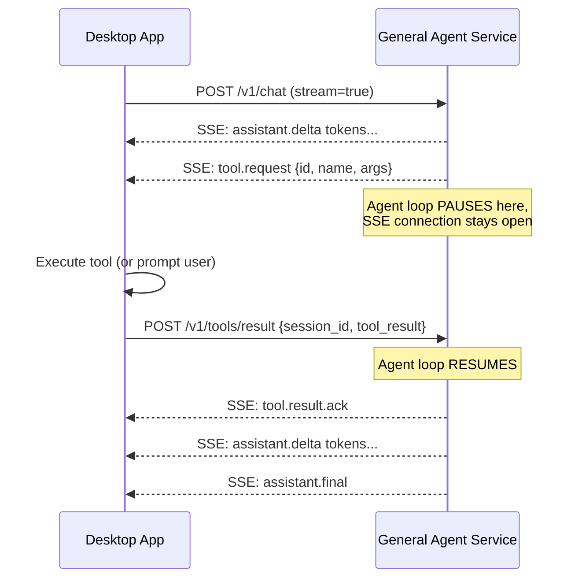

# Technical Feasibility Review

A critical review of the JARVIS design docs, identifying things that were technically difficult, over-engineered for MVP, or needed design changes. All items below have been resolved at the design level — fixes are applied to the relevant docs and will be implemented in their respective roadmap phases.

## 🔴 BLOCKING — Design Resolved, Implementation Required

### 1. Tool call loop: SSE + blocking wait is architecturally complex

**Problem**: The API doc (`11-api-general-agent-service.md`) describes this flow:
1. Service starts generating tokens, streams them via SSE
2. Service decides it needs a tool → emits `tool.request` via SSE
3. Desktop receives the request, executes the tool, POSTs the result back to `/v1/tools/result`
4. Service **resumes generation** after receiving the result

This means the agent loop must **suspend mid-generation**, hold the SSE connection open, wait for an HTTP POST on a different endpoint, then resume. This is a non-trivial async coordination problem.

**Looking at nanobot's actual code** (`agent/loop.py`), the agent loop is simple and synchronous:
```python
while iteration < self.max_iterations:
    response = await self.provider.chat(messages, tools)
    if response.has_tool_calls:
        for tool_call in response.tool_calls:
            result = await self.tools.execute(tool_call.name, tool_call.arguments)
            messages = self.context.add_tool_result(messages, ...)
    else:
        break
```
The LLM call returns **entirely** (not streaming), then tools execute, then the next LLM call happens. There's no mid-stream suspension.

**Fix**: Simplify the tool flow to match nanobot's actual pattern:



The key insight: the SSE connection from `/v1/chat` stays open during the tool wait. The service uses an `asyncio.Event` or similar to block the agent loop coroutine until the tool result arrives via the separate POST endpoint. This is clean and matches how nanobot works — the only difference is the tool execution happens remotely (on Desktop) instead of locally.

> [!IMPORTANT]
> The service needs a per-session pending tool queue. When the agent loop awaits a tool, it puts the tool request on the queue and waits. The `/v1/tools/result` endpoint pops from the queue and signals the waiting coroutine.

---

### 2. Nanobot agent loop is non-streaming

**Problem**: Nanobot's `LiteLLMProvider.chat()` calls `await acompletion(...)` which returns the full response at once — it's not streaming. But our API promises `assistant.delta` events for real-time token display.

**Fix**: We need to use `acompletion(..., stream=True)` which returns an async generator. This requires modifying the agent loop to:
1. Stream tokens as they arrive → emit SSE `assistant.delta` events
2. Detect tool calls in the streamed response (tool calls are aggregated across multiple chunks)
3. Stop streaming when tool calls are detected, execute tools, then resume

This is the single biggest change from vanilla nanobot, but it's well-supported by LiteLLM's streaming API. The modified loop:

```python
async for chunk in await acompletion(..., stream=True):
    if chunk has content delta:
        yield SSE("assistant.delta", chunk.content)
    if chunk has tool_call delta:
        accumulate tool call parts
    
if accumulated tool calls:
    # pause, wait for Desktop to execute, resume loop
```

---

## 🟡 RISKY — Mitigated

### 3. SSE Last-Event-ID replay is over-engineered for MVP

**Problem**: The SSE resilience contract (`11-api-general-agent-service.md`) requires:
- Every event gets a monotonically increasing ID
- Server buffers all events per session
- On reconnect with `Last-Event-ID`, server replays missed events
- If ID is too old, return `410 Gone`

This is a lot of complexity for a local-only app where the client and server are on the same machine.

**Fix for MVP**: Drop `Last-Event-ID` replay. Instead:
- On SSE disconnect during a turn → reconnect and re-send the last user message (agent replays the turn)
- Between turns → just reconnect (no missed events to replay)
- Mark the replay contract as **post-MVP** in the doc

---

### 4. OpenCode distribution: it's a Bun app, not a standalone binary

**Problem**: The docs say "bundle a pinned OpenCode release binary" but OpenCode is built with Bun (TypeScript runtime). It's not a single static binary — it requires the Bun runtime. 

Options:
- **Option A**: Bundle Bun + OpenCode npm package (~30MB overhead)
- **Option B**: Use `bun build --compile` to create a standalone executable (OpenCode may or may not support this cleanly)
- **Option C**: For development, just require the user to have Bun/Node installed and run `npx opencode serve`

**Fix for MVP**: Go with **Option C** for dev phase. Document the dependency. Tackle standalone bundling in Phase 4 (packaging). OpenCode's server mode (`opencode serve`) works regardless of how it's launched.

---

### 5. Glassmorphism `backdrop-filter` in WebView2

**Problem**: Tauri uses WebView2 on Windows. `backdrop-filter: blur()` is supported in modern WebView2, BUT:
- It's GPU-intensive — can cause frame drops on low-end hardware
- It only works **within** the WebView, not against the desktop behind the window (true OS transparency needs different Tauri APIs)
- Complex stacking of glassmorphism panels (sidebar + dialog + input bar) can compound GPU cost

**Fix**: Design the glassmorphism to be **degradable**:
- Use `@supports (backdrop-filter: blur(1px))` to gracefully fall back to solid semi-transparent backgrounds
- Limit blur to 2-3 panels max (sidebar + dialog OR input bar, not all at once)
- Test on integrated Intel GPUs (common in laptops) as the performance floor
- Add a "Reduce visual effects" toggle in settings for low-end machines

---

### 6. Nanobot tools execute locally — but JARVIS tools execute on Desktop

**Problem**: Nanobot's tools (shell execution, file ops, web search) run inside the agent's Python process. But JARVIS's design says the Desktop (Rust) owns tool execution for safety. This means:
- Nanobot's built-in tools (`ExecTool`, `FilesystemTool`, `WebTool`) can't be used directly
- The agent service needs to convert every tool call into a "request to Desktop" instead of executing locally

**Fix**: Replace nanobot's tool registry with a **proxy tool pattern**:
- The agent service registers tool definitions (name, schema, description) but doesn't implement execution
- When the LLM requests a tool, the agent emits a `tool.request` via SSE
- Desktop executes the tool and returns the result
- The agent loop receives the result and continues

This means the `tools/` directory in our agent service is mostly tool *schemas* and *routing*, not actual tool implementations. The implementations live in the Desktop's Rust backend.

```python
# Agent service: ProxyTool (replaces nanobot's ExecTool)
class ProxyTool(Tool):
    async def execute(self, **kwargs):
        # Don't execute locally — signal Desktop to do it
        await self.pending_requests.put(ToolRequest(name=self.name, args=kwargs))
        result = await self.pending_results.get()  # blocks until Desktop responds
        return result
```

---

### 7. Audio pipeline: Rust PTT capture requires careful threading

**Problem**: The doc says "Rust backend owns audio capture via cpal/rodio" which is correct for low-latency access. But:
- `cpal` audio capture runs on a dedicated audio thread — it can't be `async`
- Tauri's command handlers are async (tokio-based)
- The audio buffer needs to cross thread boundaries cleanly (audio thread → tokio task → send to STT backend)

**Fix**: Use a bounded channel (`tokio::sync::mpsc`) between the audio thread and an async task:
- `start_voice_capture` → spawns a cpal stream that pushes PCM chunks to the channel
- `stop_voice_capture` → signals the stream to stop, drains the channel, sends accumulated audio to STT
- This is standard practice but must be explicitly designed, not hand-waved

---

### 8. OpenCode Code Mode integration is substantially harder than General Agent

**Source**: Production source code study of [crewAI OpenCode integration](file:///C:/work/code/crewAI/.worktrees/opencode-task-context/src/crewai_enterprise/server/opencode_client.py) (791-line client, 742-line task worker).

**Problem**: Our original `03-integrations-opencode.md` treated OpenCode like a simple HTTP API. Real production code reveals 6 non-obvious patterns that are mandatory for reliable integration:

1. **Completion heuristics** (`_looks_incomplete()`)
   - Status endpoint is unreliable (`{}` while still active)
   - Must reject intermediate fragments: "Using skill: ...", text < 50 chars, lead-in keywords (e.g., "I'll...", "Let me...")
   - Must track tool/patch activity as "still running" even when text stops
   - Configurable timeouts: `response_stable_timeout=20s`, `tool_idle_grace=45s`, `incomplete_idle_grace=45s`, `max_wait=280-480s`
   - Auto-abort session if still busy when returning to prevent blocking next turn

2. **Session failure recovery** (replay pattern)
   - On any exception during prompt dispatch: abort current session, create a new one
   - Replay condensed recent history (last N messages) + current prompt into the new session
   - This is the only reliable way to recover from stuck/corrupted sessions

3. **Streaming DB persistence** (create-one + update-content)
   - Create a single DB message row on first text event
   - Update the same row's content on subsequent text events (avoids spamming partial rows)
   - This gives a live-updating message in the UI without polluting history

4. **Summary fallback prompt** ("no text, files updated" pattern)
   - If OpenCode wrote files but produced no text response (common for tool-heavy turns):
     - List workdir files
     - Send a special prompt: "Do not run tools, do not modify files, just summarize what you created"
     - Use shorter timeout (90s) for the summary

5. **File sync retry window**
   - After turn completes, files may still be written for several seconds
   - If assistant claimed file saves but initial sync found nothing: retry every 2s for `TASK_FILE_SYNC_RETRY_WINDOW` (default 12s)
   - After sync: verify claimed files actually exist via regex matching in assistant messages
   - Missing files → warn both user and OpenCode via `prompt_async`

6. **Parent-ID turn isolation**
   - Track `sync_user_message_id` to associate responses with the correct turn
   - Ignore assistant messages whose `parentID` doesn't match our turn's user message
   - This prevents returning stale responses from earlier turns

**Fix applied**: Comprehensive rewrite of `03-integrations-opencode.md` with these patterns. Phase 2 roadmap updated with explicit OpenCode complexity warning.

---

## 🟢 MINOR — Notes for Implementation (No Action Needed Yet)

### 9. Windows SAPI TTS quality

**Note**: Default Windows SAPI voices (David, Zira) sound very robotic. Users expecting "JARVIS" quality will be disappointed. Consider:
- Ship with a note that cloud TTS (e.g., ElevenLabs, OpenAI TTS) provides much better quality
- The provider-agnostic interface already handles this — just make the settings panel make it easy to switch

### 10. Nanobot uses LiteLLM — we should keep it

**Note**: Nanobot's LiteLLM provider already supports OpenAI, Anthropic, Gemini, and many others through a unified interface. This is a major advantage — we get multi-provider LLM support for free. Keep this dependency.

### 11. Session cleanup / memory limits

**Note**: The docs don't specify when sessions expire or how memory grows. For MVP:
- Sessions expire after 24h of inactivity (configurable)
- Memory (Markdown files) uses simple retention rules:
  - keep daily files for N days (e.g., 30-90), configurable
  - keep curated `MEMORY.md` under a soft size limit (warn above threshold)
- If we add a SQLite search index later, use WAL mode for concurrent reads during chat

### 12. `Ctrl+↑` message recall

**Note**: Easy to implement but store the last ~50 sent messages in a ring buffer in the frontend. Standard pattern.

## Summary of Required Doc Changes

All changes below have been applied:

| Doc | Change Applied |
|-----|---------------|
| `03-integrations-opencode.md` | **Major rewrite**: mental model, endpoint table, message parts, completion heuristics, abort semantics, agent/model selection, integration checklist |
| `11-api-general-agent-service.md` | Clarified tool call blocking model (ProxyTool + `asyncio.Event`); renamed endpoint to `/v1/tools/result`; demoted SSE replay to post-MVP |
| `13-desktop-app.md` | Added OpenCode dev deps; audio threading note; differentiated General vs Code mode streaming; added `abort_session` and `get_opencode_config` IPC commands |
| `14-ui-design.md` | Added glassmorphism `@supports` fallback, 2-panel blur limit, "Reduce visual effects" toggle |
| `15-implementation-roadmap.md` | Added streaming-agent-loop complexity callout; ProxyTool in project structure; expanded Phase 2 OpenCode steps with warning |
